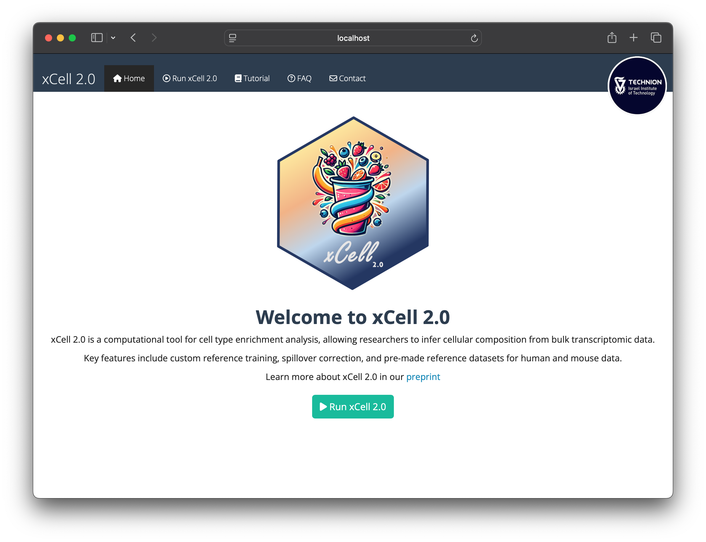

[](https://bioconductor.org/checkResults/devel/bioc-LATEST/xCell2)
<div align="center">
  
</div>

# xCell 2.0: Robust Cell Type Enrichment Analysis

## Overview
**xCell 2.0** is an advanced R package and web application for cell type enrichment analysis, building upon the widely-used xCell algorithm. It introduces a training function that allows the utilization of custom reference datasets, making it adaptable to diverse tissue types and experimental conditions.

## Installation
Install via GitHub:

```R
devtools::install_github('AlmogAngel/xCell2')
library(xCell2)
```

Install via [Bioconductor](https://bioconductor.org/packages/devel/bioc/html/xCell2.html) (development version):
```
if (!require("BiocManager", quietly = TRUE))
    install.packages("BiocManager")

# The following initializes usage of Bioc devel
BiocManager::install(version='devel')

BiocManager::install("xCell2")
```

## Vignettes

[Introduction to Cell Type Enrichment Analysis with xCell 2.0](https://aran-lab.com/xcell2-vignette)

## Using xCell 2.0 with a User Interface (No Code Required)
You can now run **xCell 2.0** with a simple and user-friendly interface using Docker Desktop, no coding required. 

Follow these steps:
  
  1. **Install Docker Desktop**
     - *Download and install Docker Desktop from [https://docs.docker.com/get-docker/](https://docs.docker.com/get-docker/).
     - Open Docker Desktop and make sure it is running.
    
  <small>\* If you already have Docker Desktop installed, you might need to update it to the latest version.</small>
  
  2. **Pull the xCell 2.0 Docker Image**
     - Navigate to the **Search** bar on the top.
     - Enter the following in the "Images" field:  
       `almogangel/xcell2`
     - Click **Pull** and wait for the image to download.  


  3. **Run the xCell 2.0 App**
     - Once the image is downloaded, find it under the **Images** tab in Docker Desktop.
     - Click the **Run** button next to the `almogangel/xcell2:latest` image.
     - In the pop-up window:
       - Go to **Optional settings**.
       - Set **Host Port** to `3838`.
       - Leave all other fields as default.
     - Click **Run** to start the container.  


  
  4. **Access the App**
     - Open your web browser and go to [http://localhost:3838](http://localhost:3838).
     - Start analyzing your data with the intuitive xCell 2.0 interface!
     - When you are done, go back to Docker Desktop and **Stop** the image.
    
  

## Contributors

xCell 2.0 is developed by the Aran lab at the Technion - Israel Institute of Technology. Contact: Almog Angel (almog.angel at campus.technion.ac.il) Dvir Aran (dvir.aran at technion.ac.il)

## Citation

If you use xCell 2.0 in your research, please cite our paper:
[Angel A, Naom L, Nabel-Levy S, Aran D. xCell 2.0: Robust Algorithm for Cell Type Proportion Estimation Predicts Response to Immune Checkpoint Blockade. bioRxiv 2024.](https://doi.org/10.1101/2024.09.06.611424)

## License

GLP 3.0
